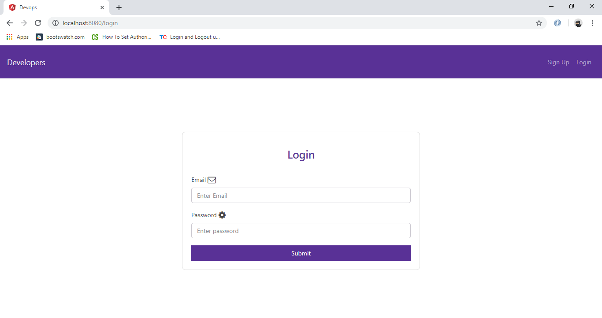

# Social Network like App
#### MEAN STACK
User Can Register Login add Experience,Education delete Experience,Education
Authentication is done using Passport JWT and JWT Token
##### Clone repo then `npm install` to install dependencies and run website by `npm start`

## Functionalities like Register,Login,Create Post,Comment on Post,Create Profile,View Profile
## Login

## Register

## DashBoard

## Post

## Comment on Post

### To Start app 
#### 1.npm install
#### 2.npm start

